# Filtre Instagram : créez votre propre filtre AR (FanMask) sur Spark AR
> Tadammm ! L’heure est venue d’apprendre à créer facilement votre premier filtre de réalité augmentée et à le partager sur Instagram avec Spark AR le meilleur logiciel qui permet aux débutants de créer des filtres impressionnants.

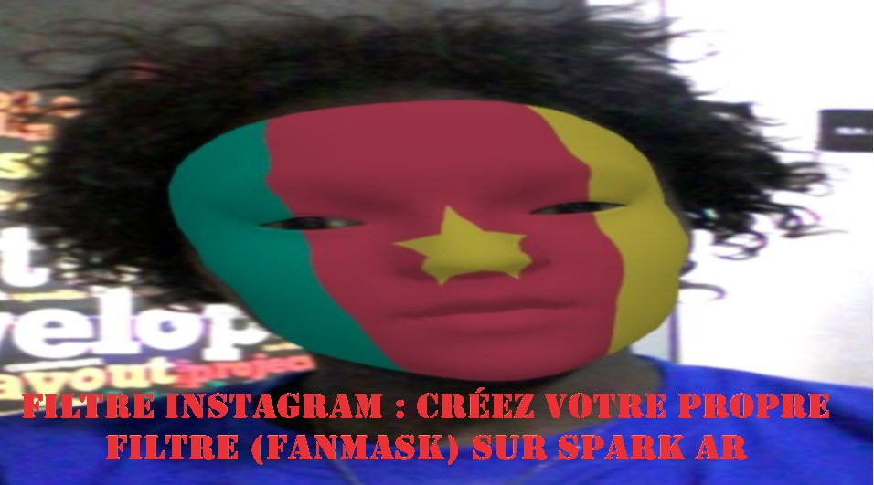

En Instagrammant, il y a de fortes chances que vous soyez entré en contact avec un filtre AR d'une manière ou d'une autre et que vous ayez probablement eu l'envie de créer votre propre filtre Instagram. Nous avons donc réalisé ce tutoriel pour vous apprendre à faire des filtres Instagram. Sachez qu'il est très **facile** de créer des filtres simples, de les rendre accessibles à tout le monde sur Instagram et **N’importe qui peut le faire** grâce au logiciel **Spark AR Studio**, qui ne fonctionne que sur ordinateur.

À travers ce tutoriel, Nous allons vous montrer comment créer facilement votre premier filtre de réalité augmentée Spark AR et le partager sur la famille d'applications Facebook comme Instagram. En utilisant :
- Spark AR Studio 
- Un smartphone
## But du guide
Le but de ce guide est de fournir un aperçu général de Spark AR Studio, de créer un filtre AR de masque facial pour fan de sport, de le tester et de l'exporter vers Instagram.
## Prérequis
- Avoir accès à une machine connectée à internet
- Avoir accès à une smartphone connectée à internet
- Avoir téléchargé et installé **Spark AR studio** sur votre machine (Si vous ne l'avez pas encore fait ou ne savez pas comment le faire, ce n'est pas grave car nous vous expliquerons comment le faire dans ce tutoriel).
- Avoir installé l’application pour iOS et Android **Spark AR Player** sur votre smartphone.
- Avoir un compte Instagram et/ou Facebook en règle.
## Sommaire
- Introduction et Prise en main de Spark AR Studio
- Création d’un filtre pour fan de sport (FanMask)
- Publier votre filtre fanMask sur Instagram

## Introduction et Prise en main de Spark AR Studio
La **réalité augmentée (RA)** est une technologie qui permet la superposition des éléments virtuels (sons, images 2D, 3D, vidéos, etc.) au sein d’un environnement en temps réel. Le principe est de combiner le virtuel et le réel et donner l’illusion d’une intégration parfaite à l’utilisateur.

**Les filtres de réalité augmentée (RA)** sont des effets générés par ordinateur conçus pour être superposés à des images réelles. Les filtres AR fonctionnent avec votre appareil photo, ajoutant un calque ou des images au premier plan ou à l'arrière-plan de votre image. Alors que les filtres AR Instagram ont été introduits en 2017, il n'était pas possible pour quiconque de créer ses propres filtres AR jusqu'à récemment ou Facebook a publié son application de création filtre AR appelée Spark AR Studio.

**Spark AR Studio** est un logiciel gratuit développer par Facebook afin d’aide tout personne à avoir une expérience en réalité augmentée par la réalisation gratuite des filtres AR pour **Instagram** et **Facebook**. Le AR signifie réalité augmentée (Augmented Reality en anglais). Le site de téléchargement et le logiciel (disponible pour Windows et Mac) sont en anglais pour le moment, mais pas d’inquiétude, nous sommes là pour vous aider. Afin de tester vos filtres AR, nous vous recommandons de télécharger également ** Spark AR Player **.

**Spark AR Player** est une application pour iOS et Android, qui vous permet de voir à quoi ressembleront en direct vos filtres AR sur un smartphone avant de le publier publiquement sur **Instagram** ou **Facebook**. 

#### Créer votre tout premier filtre AR Instagram signifiera apprendre de nouvelles idées et de nouvelles terminologies, Voici pour vous un guide étape par étape pour la prise en main de Spark AR Studio afin que vous puissiez commencer à créer votre propre filtre.

1. **Télécharger le logiciel Spark AR Studio** en allant sur le site officiel à l’adresse suivante : https://sparkar.facebook.com/ar-studio/download/. Cliquez sur « **download** » (télécharger en français) en haut et à droite de la page qui s’affichera à votre écran. 

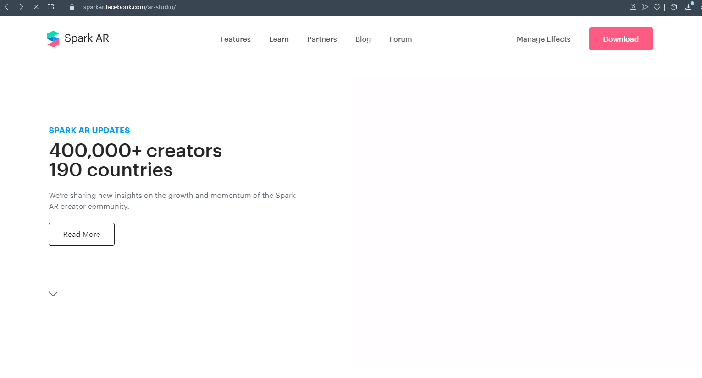

2. **Installer Spark AR Player** qui est disponible sur le Play Store de Google pour les appareils Android et sur l'App Store d'Apple pour les iPhones. Vous trouverez également cette application au milieu de la page https://sparkar.facebook.com/ar-studio/download/. Depuis votre smartphone, vous devrez cliquer sur l’un des deux boutons de téléchargement (un pour iOS et un autre pour Android) situé sous « **Get the Spark AR Player** », car depuis votre ordinateur, il ne se passera rien.

3. **Installer le logiciel Spark AR.** Si vous ne savez pas comment faire, suivez ces instructions, c'est un jeu d’enfant (nous utilisons la version 99 du 10/20/2020 pour Windows dans ce tutoriel). 

- Double cliquez sur l’icône du fichier téléchargé. Sur l'interface qui vous est présentée, cliquez sur le bouton « **Run** » 

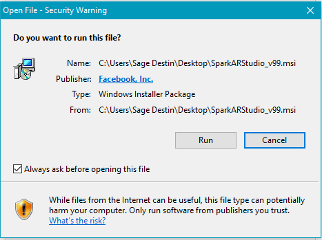

- Cliquez ensuite sur le bouton « **Next »

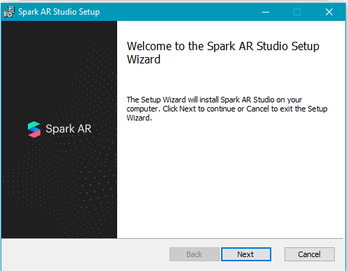

- Acceptez les termes du contrat de licence et cliquez sur « **Next »

- Dans la nouvelle fenêtre, Cliquez à nouveau sur « **Next »

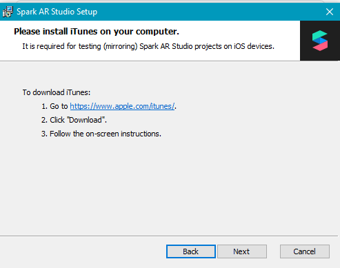

- Choisissez le disque local sur lequel vous souhaitez installer Spark AR, nous vous conseillons de laisser les valeurs par défaut et de cliquer simplement sur « **Next »

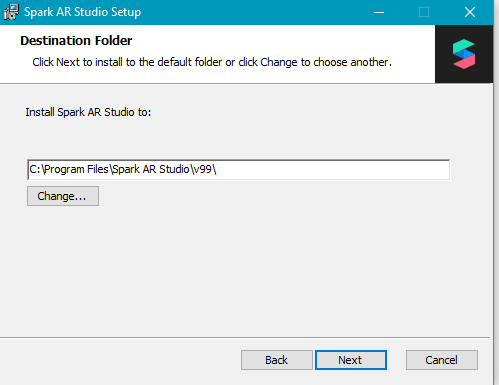

- Une fois arrivé sur l’avant dernière page, il ne vous reste plus qu’à cliquer sur « **Install** » 

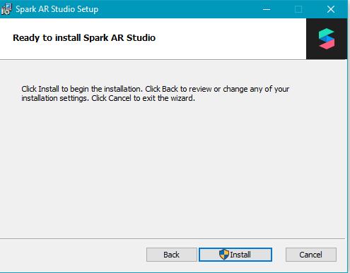

enfin cliquez sur « **finish** » pour terminer l'installation.

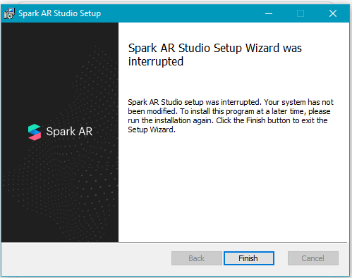

> Vérifions maintenant que l'installation s'est bien déroulée en lançant l'application.  
4. **Lancer le logiciel Spark AR Studio.** Rendez-vous sur la page d'accueil de votre PC Windows. Taper (**Spark AR**) dans la barre de recherche située en bas, à gauche de votre écran et près du carré blanc composé de quatre autres carrés blancs représentant le menu de votre ordinateur. Vous verrez apparaître l'icône Spark AR, Cliquez dessus et Attendez quelques secondes pour que l’application soit lancée. Après vous être connecté avec soit votre compte Facebook, une fenêtre ou tout du moins similaire s’ouvrira, cliquez sur « Maybe Later » (des nouvelles fonctionnalités sont ajoutées au logiciel toutes les deux semaines, vous pourriez avoir quelques choses légèrement différentes si vous utilisez une autre version). nous vous recommandons plus tard de revenir cliquez sur le bouton « **Start Tour** » qui vous montrera effets déjà réalisés et vous apprenez à les construire.

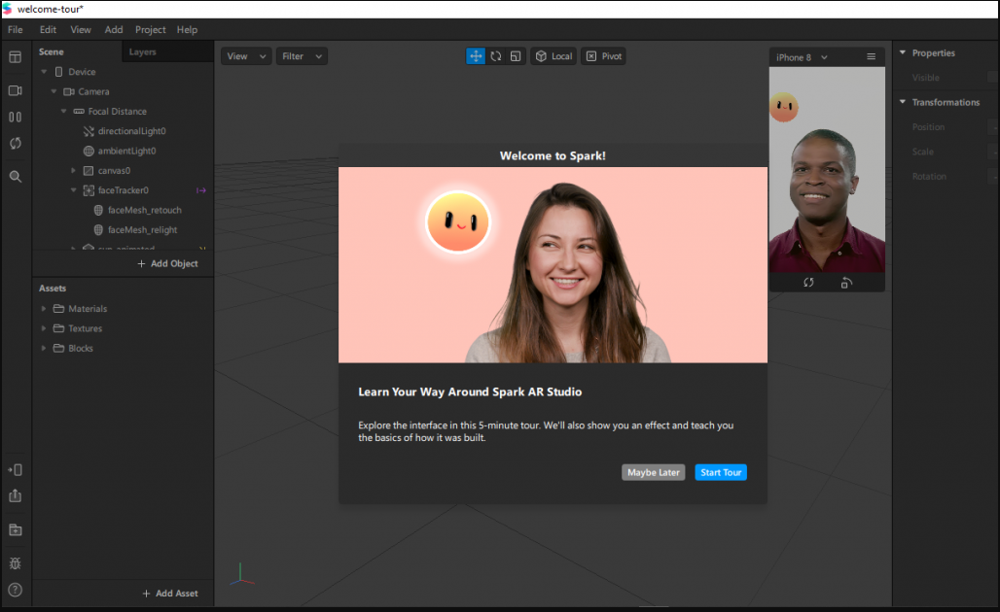

> **Remarque :** Si vous rencontrez malgré tout quelques difficultés sur l’installation ou le lancement de Spark AR, n’hésitez pas à contacter un ami qui s’y connaît un minimum dans les nouvelles technologies, pas besoin de contacter un expert en l’informatique.

### Présentation de l’interface de Spark AR Studio.
L'écran d’accueil de Spark AR vous présente des exemples de projets de base déjà réalisés qui sont aussi des tutoriels. Sur la barre latérale à gauche de votre écran, une section intitulée « Learn » vous redirigera vers des vidéos d’apprentissage. Pour ce tutoriel, Nous prendrons l’option « Create a Project » en haut à gauche qui nous permet de créer un nouveau projet a la base, sans utiliser un projet prédéfini. 

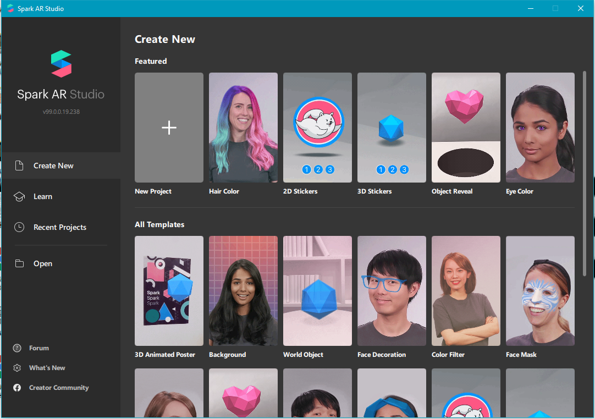

Cliquez ensuite sur “Blank projet" pour accéder au tableau de bord où nous créons notre filtre de zéro. 

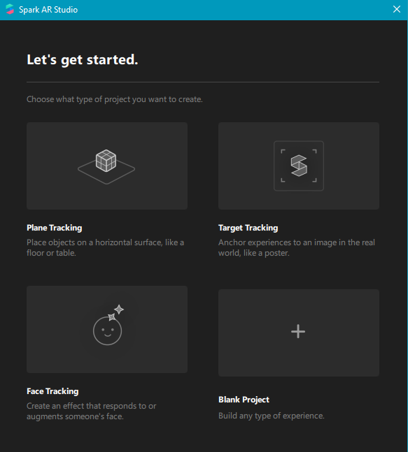

Cette nouvelle interface contient plusieurs touches que nous ne pourrons pas tous présenter explicitement ici. Disons de manière générale que cette interface de création de filtre est composée de 5 zones principales à savoir :
- **La zone 1**, située tout à gauche, comporte plusieurs boutons d’actions tels que la caméra (qui vous permettra de choisir des personnages prédéfinis pour avoir un aperçu de votre filtre ou alors activer votre webcam de l’ordinateur pour avoir un aperçu en direct), pause/play, rafraichir, recherche, tester le filtre sur votre appareil, exporter, la bibliothèque de Spark AR Studio, etc.
- **La zone 2** représente la « **Scene** » qui vous servira pour ajouter des fonctionnalités dans votre filtre, comme pour suivre les mouvements du visage, etc.
- **La zone 3** contient les « **Assets** ». Vous y retrouvez tout ce qui est objet 3D, matériel, texture.
- **La zone 4** représente votre appareil avec son écran. Vous donnant la possibilité d’avoir un aperçu en direct de votre filtre sur un modèle de personnage prédéfini, que vous pourrez modifier. La fenêtre d’aperçu en direct, avec ici, un modèle de personnage prédéfini, que vous pourrez modifier.
- **La zone 5** située tout à droite, montre les propriétés des objets que vous avez sélectionnés et que nous pourrons ajuster. 

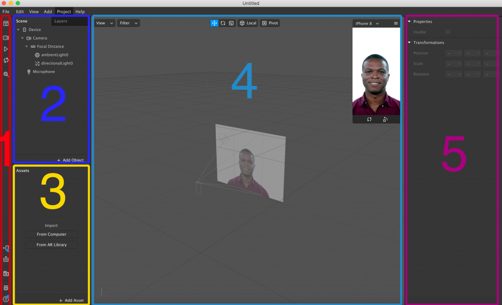

> La prise en main terminée, nous allons commencer la création d’un filtre pour fan de sport (FanMask).
## Création d’un filtre pour fan de sport (FanMask)
1. **Créez la fonctionnalité pour traquer le visage « Facetracker ».**  Le « Facetracker » permet de trouver et suivre les mouvements d’un visage, pour le Créer allez dans l'onglet "Scène", faîtes un clic droit sur « **Focal Distance** », mettez votre curseur sur « **Add** » et dans la liste qui  vous sera proposé choisissez « **Face Tracker** », cela devrait créer une nouvelle entrée dans votre scène comme ci-dessous. L’élément « faceTracker » doit être au même niveau que les deux éléments « ambientLight » et « directionalLight ». Si ce n’est pas le cas, vous avez raté quelque chose, repartez de zéro. 

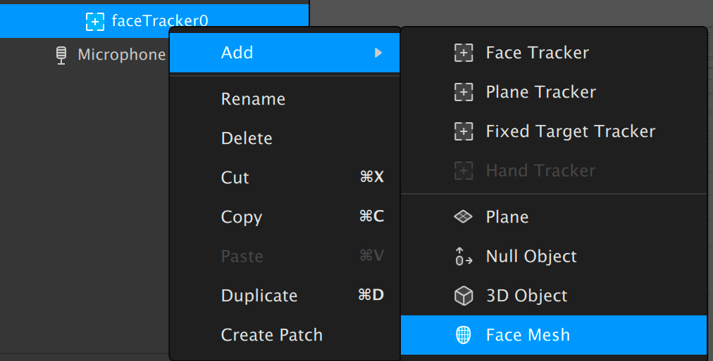

2. **Ajoutez un « Face Mesh »,** destiné à répondre aux expressions du visage et de poser un matériel. Faites un clic droit sur l’objet « **Face Mesh** », mettez votre curseur sur « **Add** » et cliquez sur élément « **Face Mesh** » dans la liste.

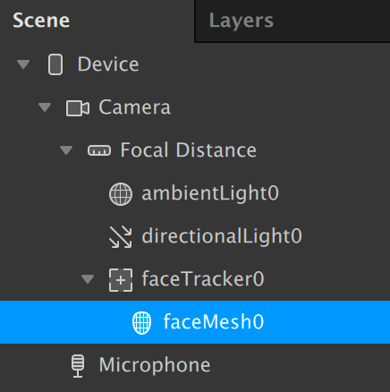

> Dans « Scene », vous avez maintenant un « Face Tracker » qui possède un « Face Mesh ».
3. **Ajoutez un matériau dans les propriétés du « Face Mesh » pour le maillage de face.** Cliquez sur «** +** » à droite de « **Materials** » situé dans la zone 5. 

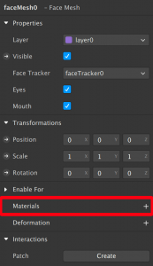

Votre matériau sera répertorié dans la zone 3  en tant que « **matérial0** » que vous pouvez renommer pour vous aider à rester organisé pendant que vous construisez votre projet. Pour ce tutoriel nous allons renommer notre  matériau0 « **facemap** ». Pour cela, faites un clic droit sur «**matériau0** », Sélectionnez « **Rename** » et renommez le « **matériau0** » en « **facemap** ».

## Publier votre filtre fanMask sur Instagram
Une fois produit votre filtre, **Spark AR Hub** vous aide à soumettre votre filtre AR pour approbation. Le processus peut prendre des jours, et si votre filtre AR répond aux différentes directives, il apparaîtra pour utilisation. Spark AR Hub donne également aux créateurs la possibilité de gérer et de comprendre les performances de vos effets AR sur Facebook et Instagram. Lorsque vous êtes prêt à publier votre filtre AR, cliquez sur le bouton "importer" dans le coin inférieur gauche de l'application.
Les filtres AR sont soumis à l'examen de Facebook. Le processus peut prendre quelques jours. Assurez-vous que votre filtre respecte les politiques et directives de Spark AR. Pour plus d'informations sur la création de filtres approuvés sans échec, lisez la soumission des effets nouvellement créés pour approbation.

Toutes nos félicitations! Vous avez créé votre premier effet Instagram Stories!

Mais avant de pouvoir être partagé sur Instagram, il doit passer par un processus d'examen pour s'assurer qu'il respecte les politiques et les conditions de la plate-forme d'effets de caméra, ainsi que le règlement de la communauté d'Instagram.

Tout d'abord, exportez votre effet en appuyant sur le bouton Exporter en bas à droite du tableau de bord Spark AR

## Conclusion
Très bien ! ’espère que ce tutorial vous aura aider et que maintenant vous savez comment créer des filtres en réalité augmentée pour Instagram.
## What’s next?
Si vous souhaitez continuer à travailler sur ce projet, voici quelques idées :
- Ajoutez plus de drapeaux d'autres pays et clubs sportifs dans ce projet ;
- Créer de nouveaux effets en utilisant d'autres fonctionnalités de Spark AR comme la Création d'un effet d'éclat avec des passes de rendu.
## Pour en savoir plus sur Spark AR.
 Voici quelques recommandations pour poursuivre votre apprentissage et de développer vos compétences sur Spark AR :
- https://sparkar.facebook.com/ar-studio/learn/tutorials/

## À propos de l’auteur
**Sage Destin:** Salut cher lecteur et lectrice! Je suis étudiant en biochimie à l'Université de Buea, Cameroun, passionné de technologie, débutant dans la création de filtrer Spark AR et le développement front-end.
